<!-- Lab 1: Connection of Network Devices Using Ethernet -->

# Lab 1: Connection of Network Devices Using Ethernet

## Step 1: Preparation of Ethernet Cable with RJ45 Connectors

### Materials Required:
- Ethernet cable (Cat5e or Cat6)
- RJ45 connectors
- Crimping tool
- Wire stripper
- Cable tester

### Procedure:

#### Type 1: Straight-through Cable
1. Cut the Ethernet cable to the desired length.
2. Strip about 1 inch of the outer jacket from both ends of the cable using the wire stripper.
3. Untwist the pairs of wires and arrange them according to the T568B wiring standard:
   - Pin 1: White/Orange
   - Pin 2: Orange
   - Pin 3: White/Green
   - Pin 4: Blue
   - Pin 5: White/Blue
   - Pin 6: Green
   - Pin 7: White/Brown
   - Pin 8: Brown
4. Trim the wires to ensure they are all the same length.
5. Insert the wires into the RJ45 connector, ensuring each wire goes into its respective slot.
6. Use the crimping tool to secure the RJ45 connector onto the cable.
7. Repeat steps 2-6 for the other end of the cable.
8. Test the cable using a cable tester to ensure proper connectivity.

#### Type 2: Crossover Cable
1. Follow steps 1-4 from the straight-through cable procedure.
2. For one end of the cable, arrange the wires according to the T568A wiring standard:
   - Pin 1: White/Green
   - Pin 2: Green
   - Pin 3: White/Orange
   - Pin 4: Blue
   - Pin 5: White/Blue
   - Pin 6: Orange
   - Pin 7: White/Brown
   - Pin 8: Brown
3. For the other end of the cable, arrange the wires according to the T568B wiring standard:
   - Pin 1: White/Orange
   - Pin 2: Orange
   - Pin 3: White/Green
   - Pin 4: Blue
   - Pin 5: White/Blue
   - Pin 6: Green
   - Pin 7: White/Brown
   - Pin 8: Brown
4. Trim the wires to ensure they are all the same length.
5. Insert the wires into the RJ45 connectors, ensuring each wire goes into its respective slot.
6. Use the crimping tool to secure the RJ45 connectors onto the cable.
7. Test the cable using a cable tester to ensure proper connectivity.

## Connection Testing Using Cable Tester
1. Connect one end of the cable to the transmitter unit of the cable tester.
2. Connect the other end of the cable to the receiver unit of the cable tester.
3. Turn on the cable tester and observe the results.

- For a straight-through cable, all pairs should show continuity in the same order. For a crossover cable, the transmit and receive pairs should be crossed.
- Orders : 1-8 for straight-through and 1-3, 2-6, 3-1, 6-2 for crossover.

## Output

### Straight-through Cable Test Results:
<table>
   <tr>
      <td align="center">
         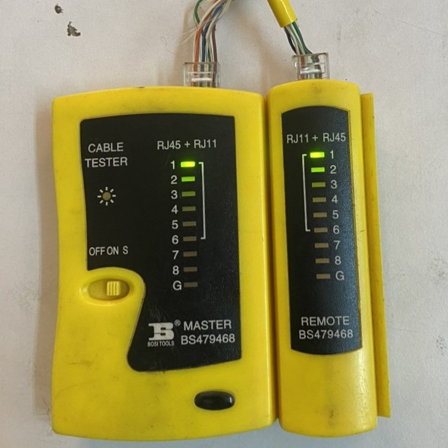
          Fig: Network Cable Tester : 1-1 (Straight Through)
      </td>
      <td align="center">
         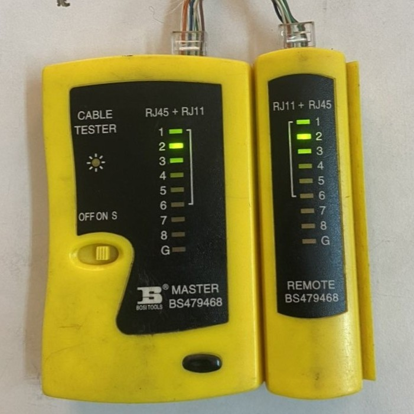
          Fig: Network Cable Tester : 2-2 (Straight Through)
      </td>
      <td align="center">
         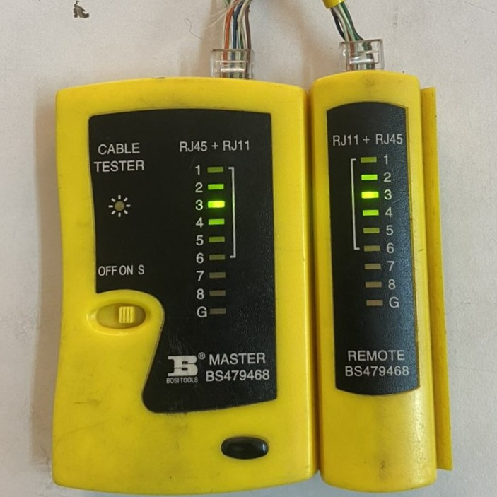
          Fig: Network Cable Tester : 3-3 (Straight Through)
      </td>
   </tr>
   <tr>
      <td align="center">
         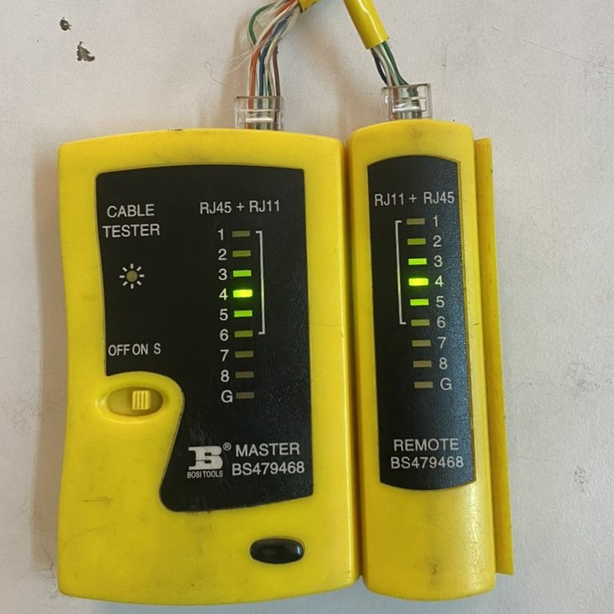
          Fig: Network Cable Tester : 4-4 (Straight Through)
      </td>
      <td align="center">
         
          Fig: Network Cable Tester : 5-5 (Straight Through)
      </td>
      <td align="center">
         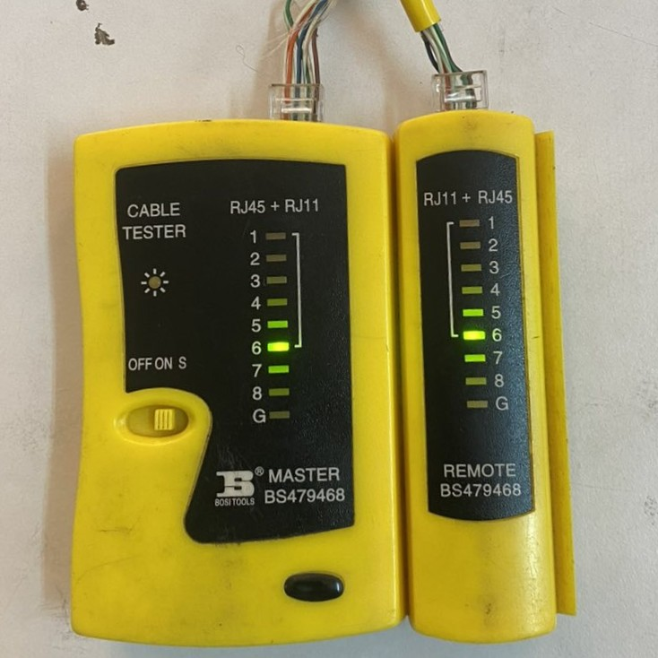
          Fig: Network Cable Tester : 6-6 (Straight Through)
      </td>
   </tr>
   <tr>
      <td align="center">
         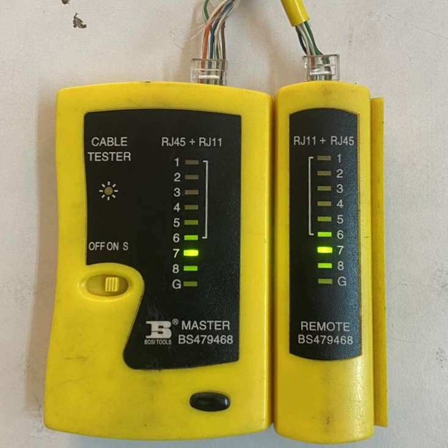
          Fig: Network Cable Tester : 7-7 (Straight Through)
      </td>
      <td align="center">
         
          Fig: Network Cable Tester : 8-8 (Straight Through)
      </td>
      <td></td>
   </tr>
</table>

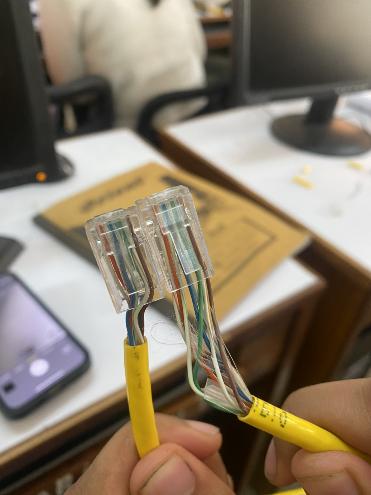
Fig: RJ45 Connectors on Straight-through Cable

### Crossover Cable Test Results:
<table>
   <tr>
      <td align="center">
         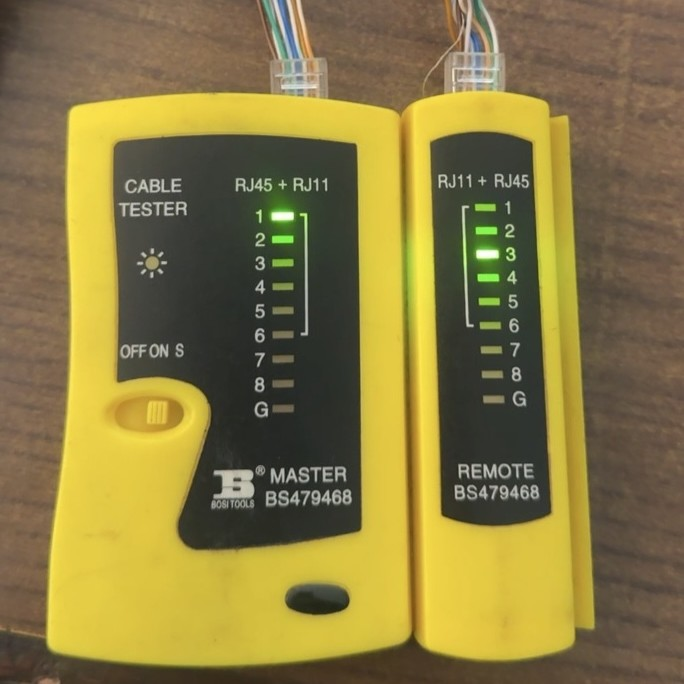
          Fig: Network Cable Tester : 1-3 (Crossover)
      </td>
      <td align="center">
         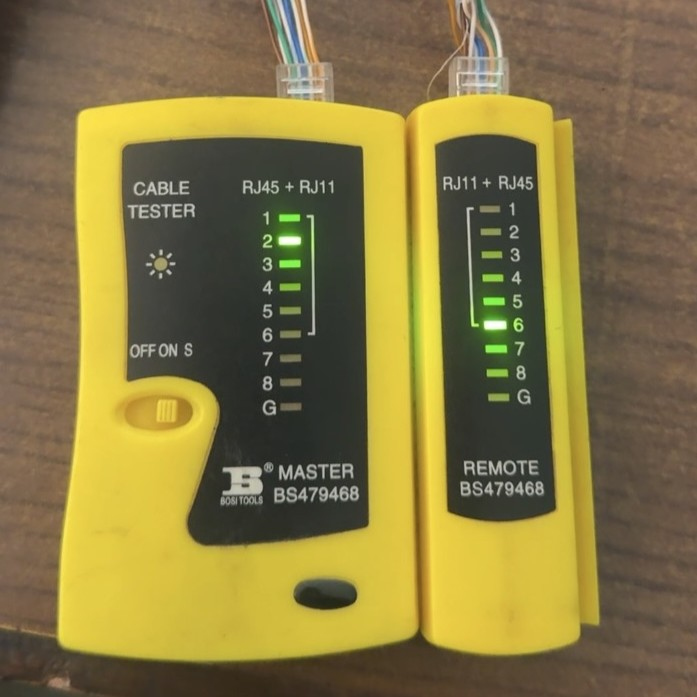
          Fig: Network Cable Tester : 2-6 (Crossover)
      </td>
      <td align="center">
         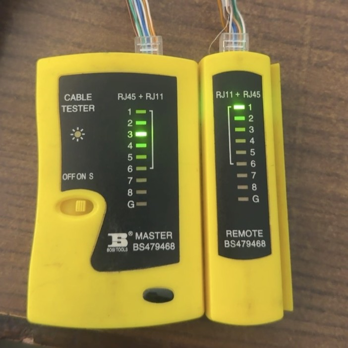
          Fig: Network Cable Tester : 3-1 (Crossover)
      </td>
   </tr>
   <tr>
      <td align="center">
         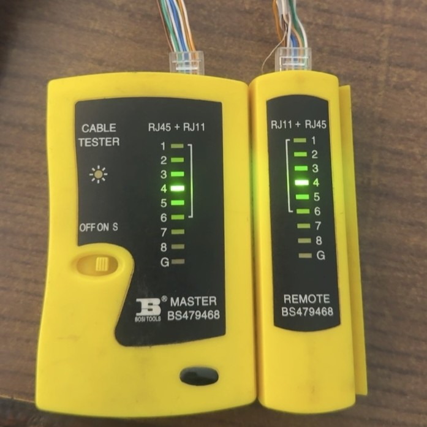
          Fig: Network Cable Tester : 4-4 (Crossover)
      </td>
      <td align="center">
         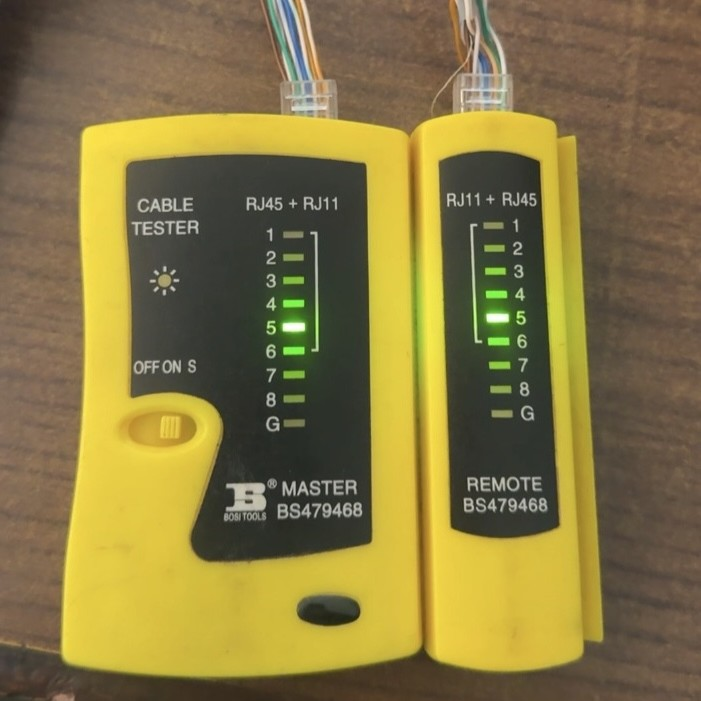
          Fig: Network Cable Tester : 5-5 (Crossover)
      </td>
      <td align="center">
         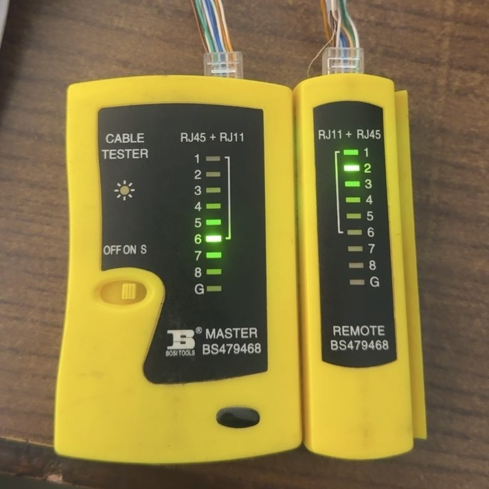
          Fig: Network Cable Tester : 6-2 (Crossover)
      </td>
   </tr>
   <tr>
      <td align="center">
         
          Fig: Network Cable Tester : 7-7 (Crossover)
      </td>
      <td align="center">
         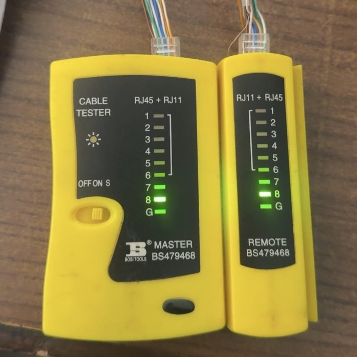
          Fig: Network Cable Tester : 8-8 (Crossover)
      </td>
      <td></td>
   </tr>
</table>

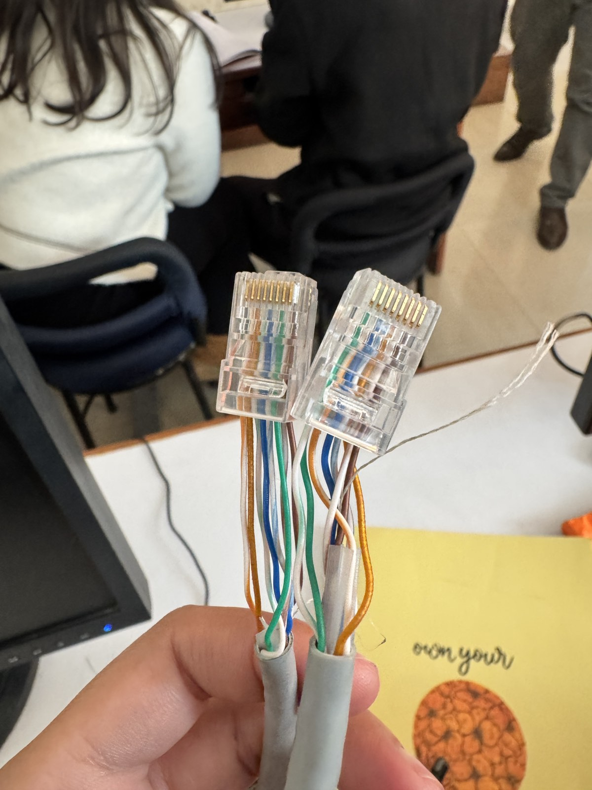
Fig: RJ45 Connectors on Crossover Cable

## Results:
- The cable tester should indicate that all wires are properly connected and there are no faults.
- Visible Outputs are shown in images in the sub-folders straight and crossover.