<!-- Lab 2: Network Commands for Testing and Troubleshooting -->

# Lab 2: Network Commands for Testing and Troubleshooting

## Objective:
To familiarize with essential network commands used for testing and troubleshooting network connectivity issues.

## Required Tools:
- A computer with command line interface (CLI) access
- Network connection (wired or wireless)

## Network Commands:
<!-- Used Commands: ping, ipconfig, tracert, netstat (-a,-n), nslookup, arp, telnet, netsh wlan, pathping, route print, getmac, nbtstat, whois -->

### Syntax and Usage of Common Network Commands:

1. **ping**
   - Syntax: `ping [hostname or IP address]`
   - Usage: Tests the reachability of a host on an IP network and measures the round-trip time for messages sent from the originating host to a destination computer.

2. **ipconfig (Windows) / ifconfig (Linux)**
   - Syntax: `ipconfig` or `ifconfig`
   - Usage: Displays all current TCP/IP network configuration values and refreshes DHCP and DNS settings.

3. **tracert (Windows) / traceroute (Linux)**
   - Syntax: `tracert [hostname or IP address]` or `traceroute [hostname or IP address]`
   - Usage: Determines the route taken by packets to reach a specific host by listing all the intermediate routers.

4. **netstat**
   - Syntax: `netstat -a` or `netstat -n`
   - Usage: Displays active TCP connections, ports on which the computer is listening, Ethernet statistics, and more.

5. **nslookup**
   - Syntax: `nslookup [hostname]`
   - Usage: Queries the Domain Name System (DNS) to obtain domain name or IP address mapping information.

6. **arp**
   - Syntax: `arp -a`
   - Usage: Displays and modifies the IP-to-Physical (MAC) address translation table used by the Address Resolution Protocol (ARP).

7. **telnet**
   - Syntax: `telnet [hostname or IP address] [port]`
   - Usage: Connects to a remote host using the Telnet protocol, useful for testing connectivity to specific ports.
   
8. **netsh wlan (Windows)**
   - Syntax: `netsh wlan show profiles` or `netsh wlan connect name=[profile name]`
   - Usage: Manages wireless network profiles and connections on Windows systems.

9. **pathping**
   - Syntax: `pathping [hostname or IP address]`
   - Usage: Combines the functionality of ping and tracert to provide information about network latency and packet loss at each hop.

10. **route print**
    - Syntax: `route print`
    - Usage: Displays the current IP routing table on the local machine.

11. **getmac**
    - Syntax: `getmac`
    - Usage: Displays the MAC addresses for network adapters on the local machine.

12. **nbtstat**
    - Syntax: `nbtstat -a [hostname]`
    - Usage: Displays NetBIOS over TCP/IP statistics, including the NetBIOS name table of a remote computer.

13. **whois**
    - Syntax: `whois [domain name]`
    - Usage: Retrieves registration information about a domain name from the WHOIS database.

## Procedure:
1. Open the command line interface (CLI) on your computer.
2. Use the `ipconfig` or `ifconfig` command to check your current network configuration.
3. Usage of the commands are shown in the output files.

## Output:

<table><!-- Format of Table 2*6 with max width possible -->

   <tr>
      <td align="center">
         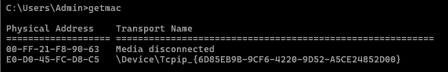
          Fig: GETMAC Command Output
      </td>
      <td align="center">
         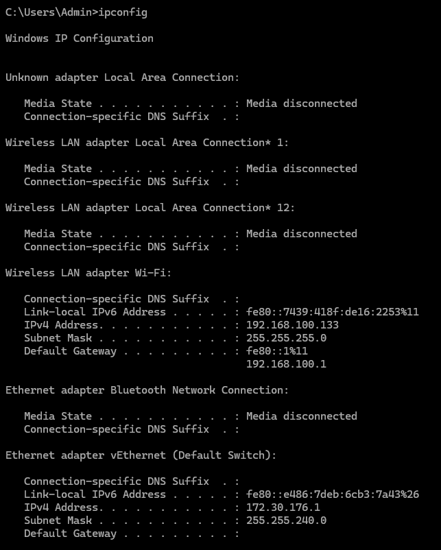
          Fig: IPCONFIG Command Output
      </td>
      <td align="center">
         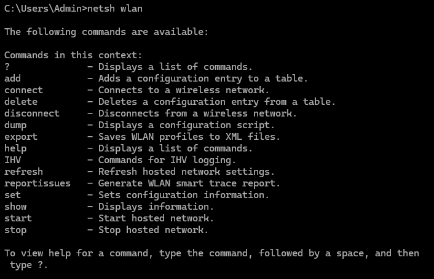
          Fig: NETSH Command Output
      </td>
      <td align="center">
         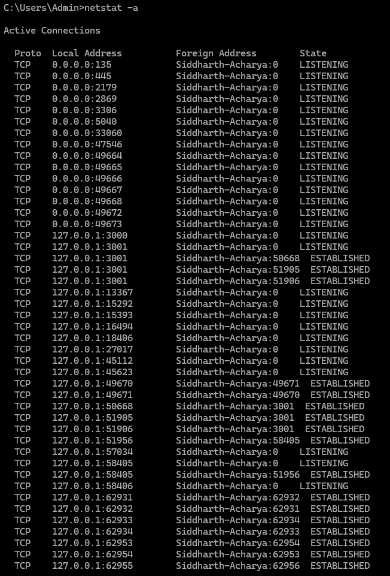
          Fig: NETSTAT -A Command Output
      </td>
      <td align="center">
         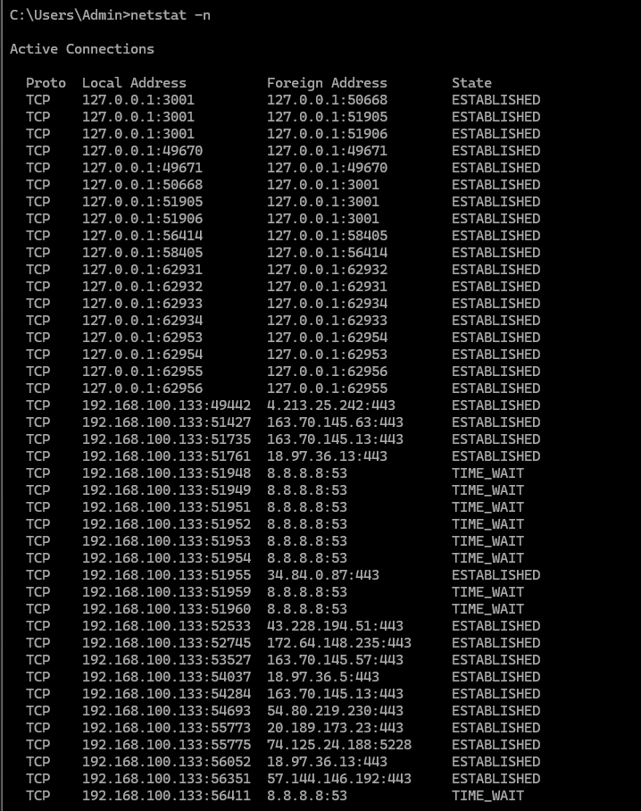
          Fig: NETSTAT -N Command Output
      </td>
      <td align="center">
         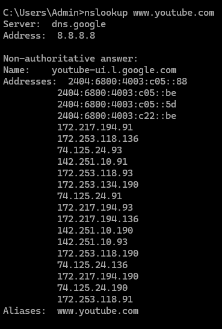
          Fig: NSLOOKUP Command Output
      </td>
   </tr>
   <tr>
      <td align="center">
         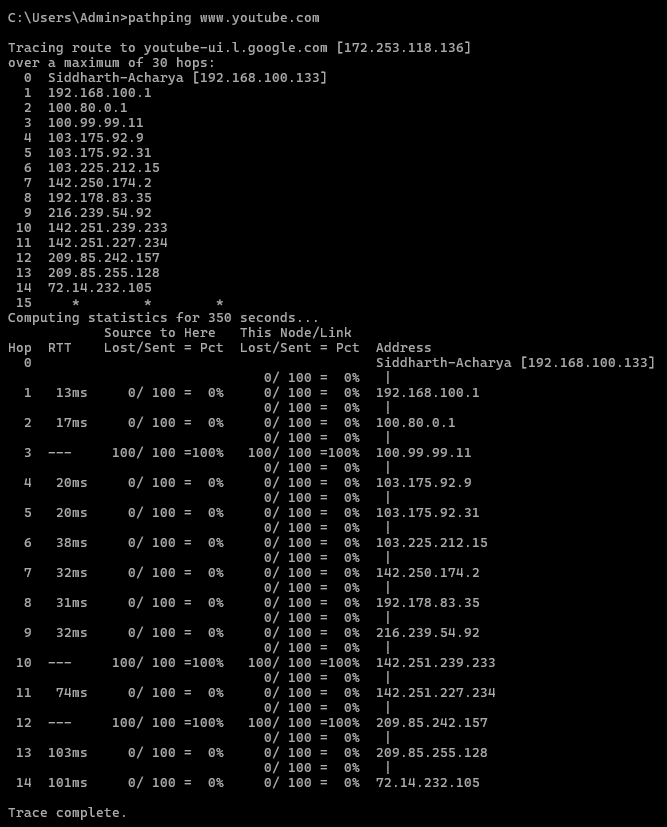
          Fig: PATHPING Command Output
      </td>
      <td align="center">
         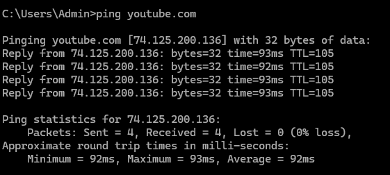
          Fig: PING Command Output
      </td>
      <td align="center">
         
          Fig: ROUTE PRINT Command Output
      </td>
      <td align="center">
         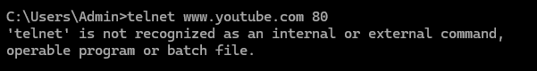
          Fig: TELNET Command Output
      </td>
      <td align="center">
         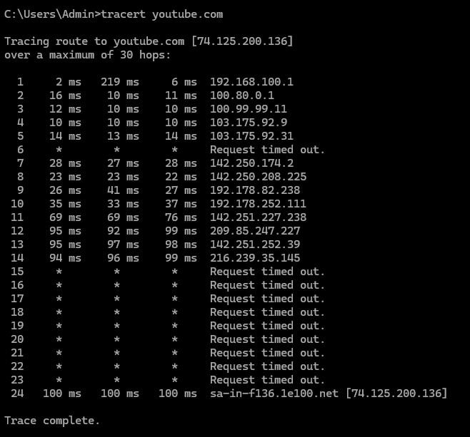
          Fig: TRACERT Command Output
      </td>
      <td align="center">
         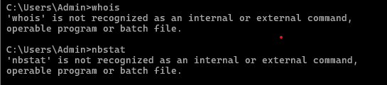
          Fig: UNRECOGNIZED Command Output
      </td>
   </tr>
</table>

## Conclusion:
This lab provided hands-on experience with various network commands essential for diagnosing and troubleshooting network issues. Mastery of these commands is crucial for network administrators and IT professionals to maintain network health and performance.