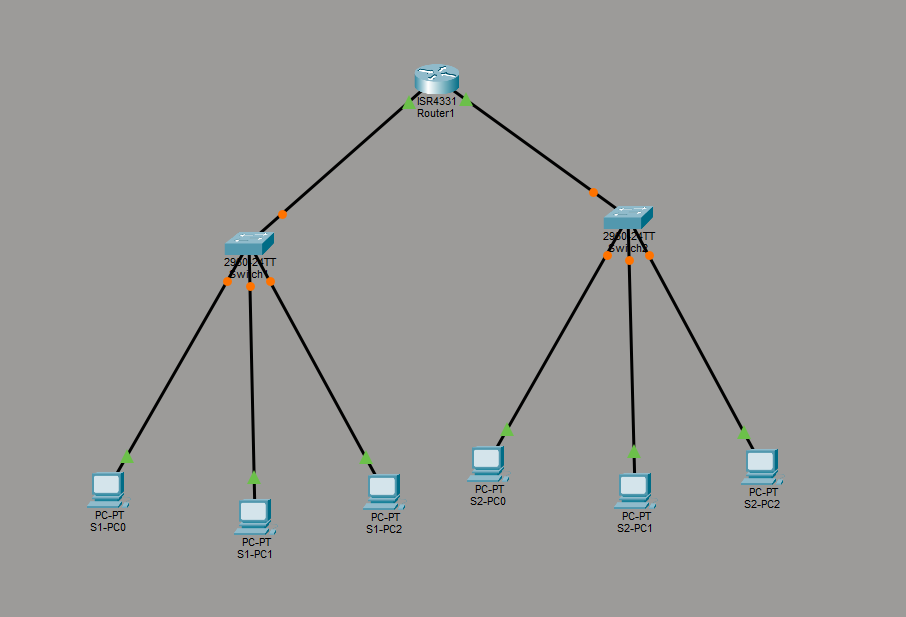
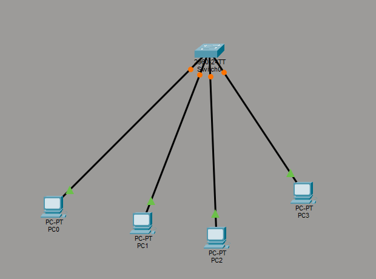
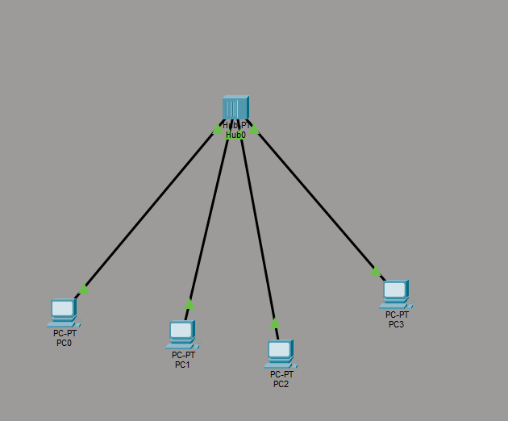
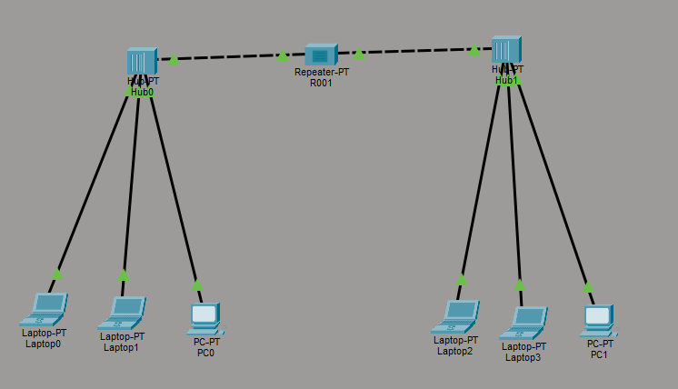
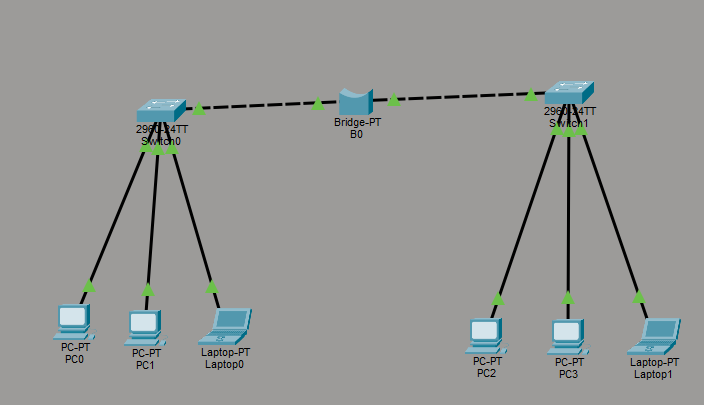

# Lab 3: Simulation of Network Devices Using Cisco Packet Tracer

## Objective

Simulation using Hub, Switch, Router, Repeater, and Bridge in Cisco Packet Tracer. 

## Theory

### Cisco Packet Tracer Overview
Cisco Packet Tracer is a powerful network simulation tool developed by Cisco Systems. It allows users to create virtual network topologies, configure devices, and simulate network behavior without the need for physical hardware. This tool is widely used for educational purposes, enabling students and professionals to practice networking concepts and configurations in a safe and controlled environment.

### Network Devices Simulated

1. **Hub**: A basic networking device that connects multiple Ethernet devices, making them act as a single network segment. It operates at the physical layer (Layer 1) of the OSI model and broadcasts incoming data packets to all connected devices.

2. **Switch**: An advanced networking device that connects devices within a network and uses MAC addresses to forward data only to the intended recipient. It operates at the data link layer (Layer 2) of the OSI model, improving network efficiency compared to hubs.

3. **Router**: A networking device that connects multiple networks and routes data packets between them. It operates at the network layer (Layer 3) of the OSI model and uses IP addresses to determine the best path for data transmission.

4. **Repeater**: A network device that regenerates and amplifies signals to extend the distance over which data can travel in a network. It operates at the physical layer (Layer 1) of the OSI model.

5. **Bridge**: A device that connects two or more network segments, improving traffic management by filtering data based on MAC addresses. It operates at the data link layer (Layer 2) of the OSI model.

## Lab Tasks

### Task 1: Simulation of Hub

**Objective:** Demonstrate the basic functionality of a hub in a network.

**Configuration:** 1 Hub connected to 4 PCs  
**IP Address Range:** 192.168.1.0/24

| Device | IP Address   | Subnet Mask     |
|--------|--------------|----------|
| PC0    | 192.168.1.1  | 255.255.255.0   |
| PC1    | 192.168.1.2  | 255.255.255.0   |
| PC2    | 192.168.1.3  | 255.255.255.0   |
| PC3    | 192.168.1.4  | 255.255.255.0   |

### Task 2: Simulation of Switch

**Objective:** Demonstrate the basic functionality of a switch in a network.

**Configuration:** 1 Switch connected to 4 PCs  
**IP Address Range:** 192.168.1.0/24

| Device | IP Address   | Subnet Mask     |
|--------|--------------|----------|
| PC0    | 192.168.1.1  | 255.255.255.0   |
| PC1    | 192.168.1.2  | 255.255.255.0   |
| PC2    | 192.168.1.3  | 255.255.255.0   |
| PC3    | 192.168.1.4  | 255.255.255.0   |

### Task 3: Simulation of Router

**Objective:** Demonstrate the routing functionality between two different networks.

**Configuration:**
- Switch 1 connected to 3 PCs (Network: 192.168.1.0/24)
- Switch 2 connected to 3 PCs (Network: 10.10.10.0/8)
- Router connecting both switches

**PC Configuration:**

| Device  | IP Address  | Subnet Mask     |
|---------|-------------|----------|
| S1-PC0  | 192.168.1.1 | 255.255.255.0   |
| S1-PC1  | 192.168.1.2 | 255.255.255.0   |
| S1-PC2  | 192.168.1.3 | 255.255.255.0   |
| S2-PC0  | 10.10.10.1  | 255.0.0.0       |
| S2-PC1  | 10.10.10.2  | 255.0.0.0       |
| S2-PC2  | 10.10.10.3  | 255.0.0.0       |

**Router Interface Configuration:**

| Interface | IP Address  | Subnet Mask   |
|-----------|-------------|---------------|
| Gig0/0/0  | 192.168.1.4 | 255.255.255.0 |
| Gig0/0/1  | 10.10.10.4  | 255.0.0.0     |

### Task 4: Simulation of Repeater

**Objective:** Demonstrate signal regeneration and amplification over extended distances.

**Configuration:**
- 2 PCs in the source network (192.168.1.0/24)
- 1 Repeater to extend the network signal
- 2 PCs in the extended network (192.168.2.0/24)

**Key Points:**
- Repeaters operate at Layer 1 (Physical Layer)
- They regenerate signals to overcome attenuation over long cable runs
- No intelligent routing or filtering is performed
- Used to extend network segment distances beyond cable limitations

### Task 5: Simulation of Bridge

**Objective:** Demonstrate the functionality of a bridge in connecting two different network types.

**Configuration:**
- Network 1: IPv4 network (192.168.1.0/24) with 2-3 PCs
- Bridge Device: Protocol translation and routing
- Network 2: Different protocol/architecture network with 2-3 PCs

**Key Points:**
- Bridges operate at the Data Link layer (Layer 2) and Network layer (Layer 3)
- They perform protocol translation between different network types
- Can bridge incompatible network architectures
- Essential for communication between heterogeneous networks

## Output

<table>
   <tr>
      <td align="center">
         
          Fig: Router Simulation
      </td>
      <td align="center">
         
          Fig: Switch Simulation
      </td>
      <td align="center">
         
          Fig: Hub Simulation
      </td>
   </tr>
   <tr>
      <td align="center">
         
          Fig: Repeater Simulation
      </td>
      <td align="center">
         
          Fig: Bridge Simulation
      </td>
      <td>
      </td>
   </tr>
</table>

## Conclusion
Cisco Packet Tracer is a powerful network simulation tool that allows users to create and test network configurations in a virtual environment. This lab provided hands-on experience in simulating various network devices, including hubs, switches, routers, repeaters, and bridges. Understanding how to  configure and connect these devices is essential for network design and troubleshooting.